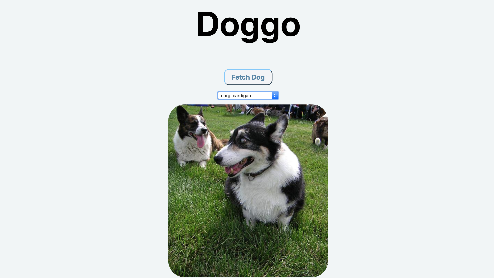

# Introduction to Web Development (Version 2)
An introduction (or review) of the basics of Web Development from Frontend masters

## Resources
https://btholt.github.io/intro-to-web-dev-v2/

## Sections
* Introduction
* Learning HTML
* Learning CSS
* Learning JavaScript
* Using Ajax and Node.js
* Learning Git
* Using Node.js

## TOPICS OVERALL
* Javascript
    * var, val, const
    * scope
    * event delegation
* AJAX
    * API
    * JSON
    * promise
        * promise chaining

## Project
### #1

### #2

### #3
